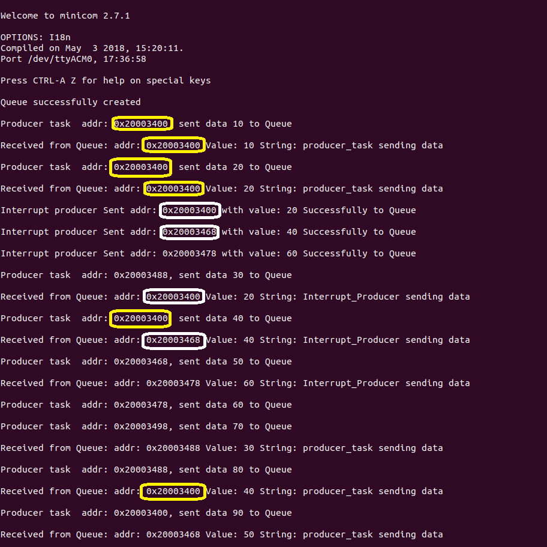

The idea of this project is to demonstrate understanding of some FreeRTOS concepts like,

1. Synchronisation mechanism (Binary Semaphore)
2. Heap Memory management
3. Using Queue data structure
4. Interrupts and Peripheral setup ( USART, GPIOs)
5. Task handling in FreeRTOS

The idea is to implement a producer-consumer model where a producer and a consumer are periodically
producing and consuming data while another producer (Interrupt controlled) produces data only on
button push. The data is shared to consumer through a Queue, which is sent to the USART by the consumer.

Below is an illustration of Heap type-4 management with First-fit algorithm. In example shown here, the address allocated is carefully freed after each transfer and with heap_4 management, notice address (0x20003400) used by task (Producer) is reused by another task (Interrupt Producer) which executes later

