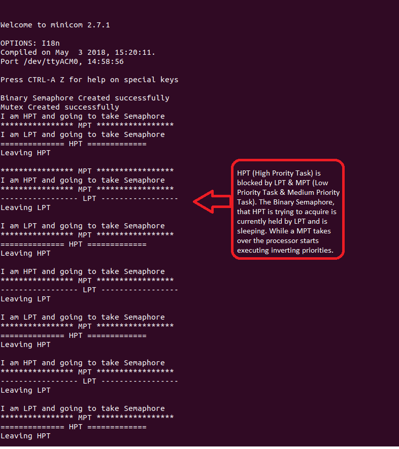

The idea of this project is to demonstrate understanding of some FreeRTOS concepts like,

1. Synchronisation mechanism 
	a. Binary Semaphore
	b. Mutex
2. Priority Inversion
2. Priority Inheritance

Priority inversion may occur while using binary semaphore. In this project this situation is illustrated while using Binary Semaphore to control access to Critical section to 3 tasks of different priorities, HPT (High Priority Task), MPT (Medium Priority Task) and LPT (Low Priority Task). 

Priority Invserion can be avoided by using mutex (Synchronization locking mechanism) that handles priority inversion by inheriting the blocked high priority task's priority to low priority task that is currently holding the lock.

